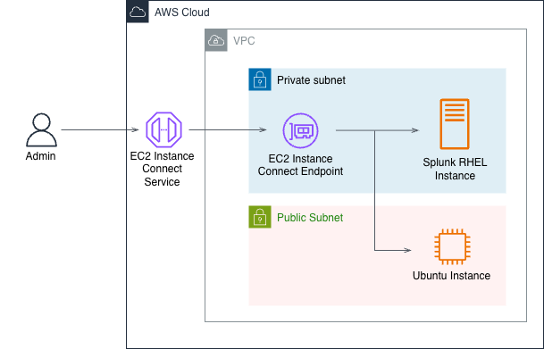

# VPC Configuration

## Design descisions

### Admin Access

Admin accesses instances through EIC (EC2 Instance Connect)
This method creates a private tunnel using the EIC endpoint and EIC service

EIC endpoint creates its own session keys with the remote instance, linux will show the endpoint's IP address (`10.0.2.49`)

### Internet Access
Internet access is only available to instances via the NAT gateway

Amazon's NAT gateway only allows outbound requests to the internet, and blocks any inboudn intiated requests

