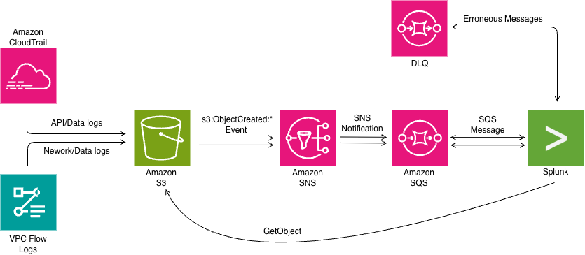

## Log Flow

This method of retrieving logs involves Splunk being notified by an SNS Fanout -> SQS Queues.  
This is followed by SQS queue messages notifying Splunk once new logs have been created.   If any messages are lost they are stored in a DLQ (Dead Letter Queue)  

  
- When events (objects) are uploaded to S3, SNS is notified. SNS then fans out this feed to SQS subscribers which notify Splunk of the event.
- Errors are saved in Dead Letter Queues.
  
This method allows for almost instantaneous arrival of logs to the index. You can optionally configure and specify VPC Interface Endpoints for SQS, STS and S3 services to use private endpoints instead of public endpoints for secure data collection and authentication. 

This method can be used to collect:
- CloudFront Access Logs
-Config
- ELB Access logs
- CloudTrail
- S3 Access Logs
- VPC Flow Logs
- Transit Gateway Flow Logs
- Custom data types

Other methods of log retrevial include:
- Generic S3
- Incremental S3
- SQS

 
- Two inputs made in Splunk to forward logs from S3.
