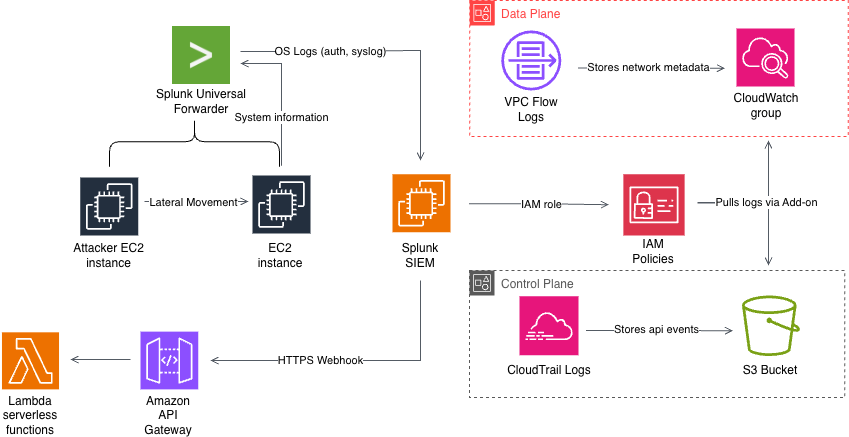

# System Threat Modeling

## Security Objectives, Component Breakdown, and Scope

### Automated Ingestion Response Lab

#### System Information

- Automated Ingestion Response Lab contains an internet-facing EC2 instance hosted in a public subnet for external client requests.
- An second, internal EC2 instance is located in a private subnet for internal workloads and is not directly accessible by the internet.
- A third interal instance with Splunk Enterprise used to ingesting logs across AWS.
- System logs are sent from Splunk Universal Forwarder (installed on the public and private instances) to Splunk SIEM. VPC flow logs containing network metadata are sent to CloudWatch log groups, and CloudTrail logs are stored in S3 buckets. Splunk SIEM periodically pulls these logs using IAM permissions.
- Splunk ingests these logs, and performs event indexing, correlation, threat detection, and alert generation.
- When a detection rule is triggered, Splunk sends these alerts via a webhook to Amazon API Gateway, which invokes serverless Lambda  functions to exectue automated mitigation and response actions.

### Data Flow Diagram

### Internal Assests
- EC2 instances
- Credentials / IAM roles
- Network access
- Logs and telemetry

Threat Actors
- External attacker machine
- Compromised public machine

Attack Techniques
Mapped to MITRE ATT&CK, for example:
- SSH brute force (T1110)
- Privilege escalation (T1068)
- Persistence (T1053)
- Cloud API abuse (T1098)

Assumptions
- Single AWS account
- No internal malicious users
- Limited lateral movement

#### Out of Scope
- Physical access
- Zero-day kernel exploits
- Multi-account compromise

#### Reducing false positives
- Correlating multiple signals
- Detecting sequences (e.g., API change → SSH → privilege escalation)
- Making detections defendable
