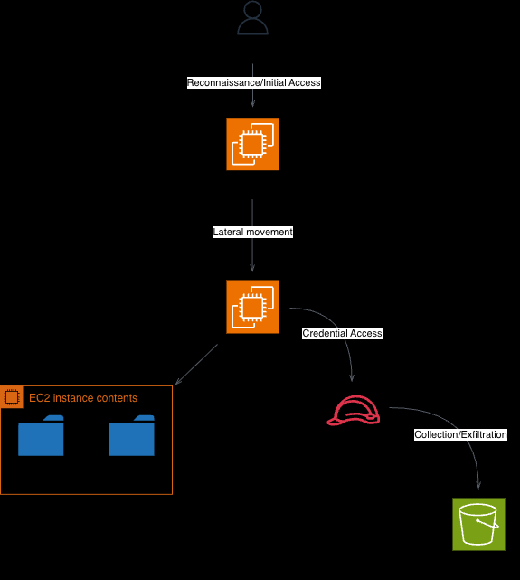

# Kill Chain

### Stage 1 - Reconnaissance
**T1595** - Port scanning

### Stage 2 - Initial Access
**T1190** - Exposed SSH service

### Stage 3 - Discovery (local)
**T1087.001** - Enumerate local accounts

**T1083** - Search for local hosts and private keys

### Stage 4 - Lateral Movement
**T1021.004** - SSH to private instance using found private keys

### Stage 5 - Credential Access
**T1110.001** - Hydra brute force

**T1552.005** - Query IMDS on private instance for IAM role credentials

### Stage 6 - Discovery (cloud)
**T1580** - AWS CLI enumeration using stolen credentials

### Stage 7 - Collection/Exfiltration
**T1530** - Access and enumerate S3 bucket

**T1537** - Copy data to attacker controlled bucket

